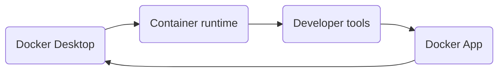

# Introduction to Docker
Docker is a platform that simplifies the process of building, sharing, and running software applications using containers. It consists of two main components:

* **Docker Desktop:** This is a user-friendly application you install on your computer (Windows, macOS) that provides tools for local development using containers.
* **Docker Hub:** This is a cloud-based service where you can store and share Docker images (the blueprints for containers). You can find both publicly available images and create private repositories for your own projects.

## Docker containers
The key idea behind Docker is the use of **containers, which are lightweight, standalone packages that contain everything needed to run an application**. This includes the application code itself, libraries, dependencies, and even the underlying operating system (OS) components.

**Key Benefits of Docker Containers:**

* Containers bundle all necessary dependencies, you can be confident that an application will run the same way regardless of the underlying environment.
* Containers are much smaller than traditional virtual machines (VMs) because they share the host OS kernel and do not need to include a full OS copy for each application. This leads to faster startup times and more efficient use of system resources.
* Containers are a core component of modern DevOps practices. They enable infrastructure as code (IaC), where you can define your infrastructure (including containers) using code, making it repeatable and automated.

## Docker Images
A Docker image is a read-only template used to create Docker containers. You can think of it as the blueprint from which you create multiple, identical container instances.

A Dockerfile is a text file containing instructions that Docker uses to build a Docker image. It specifies the base image to start with, the application code to add, dependencies to install, and other configurations.
# Docker hub
Docker Hub is a cloud-based platform that acts as a centralized repository for Docker images, similar to how GitHub functions for code repositories. Developers use Docker Hub to store, share, and discover Docker images, which serve as the building blocks for creating and deploying applications using containers. 

## Key Features

- Docker Hub's primary function is to host and distribute Docker images.
- Anyone can access and use images stored in public repositories. This makes it easy to find and use common software components in your projects.
- You can create private repositories on Docker Hub to store and manage images that you want to keep within your organization or team. This is useful for internal projects or for distributing proprietary software.
- Docker Hub can automate the process of building Docker images from source code hosted on GitHub.
- Docker Hub offers features for collaboration, allowing you to create organizations and manage teams with varying levels of access to your repositories.
- Docker Hub supports image versioning, enabling you to track different versions of your Docker images and roll back to previous versions if needed.